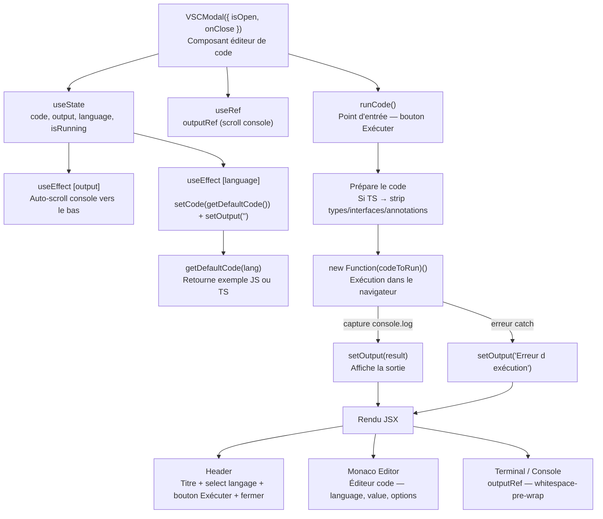

```mermaid
flowchart TD
    A["VSCModal({ isOpen, onClose })
    Composant éditeur de code"]

    A --> US["useState
    code, output, language, isRunning"]

    A --> UR["useRef
    outputRef (scroll console)"]

    US --> EF1["useEffect [output]
    Auto-scroll console vers le bas"]

    US --> EF2["useEffect [language]
    setCode(getDefaultCode()) + setOutput('')"]

    EF2 --> GD["getDefaultCode(lang)
    Retourne exemple JS ou TS"]

    A --> RC["runCode()
    Point d'entrée — bouton Exécuter"]

    RC --> PP["Prépare le code
    Si TS → strip types/interfaces/annotations"]

    PP --> EX["new Function(codeToRun)()
    Exécution dans le navigateur"]

    EX -->|"capture console.log"| OUT["setOutput(result)
    Affiche la sortie"]

    EX -->|"erreur catch"| ERR["setOutput('Erreur d exécution')"]

    OUT --> R["Rendu JSX"]
    ERR --> R

    R --> HD["Header
    Titre + select langage + bouton Exécuter + fermer"]

    R --> ED["Monaco Editor
    Éditeur code — language, value, options"]

    R --> TM["Terminal / Console
    outputRef — whitespace-pre-wrap"]
```
