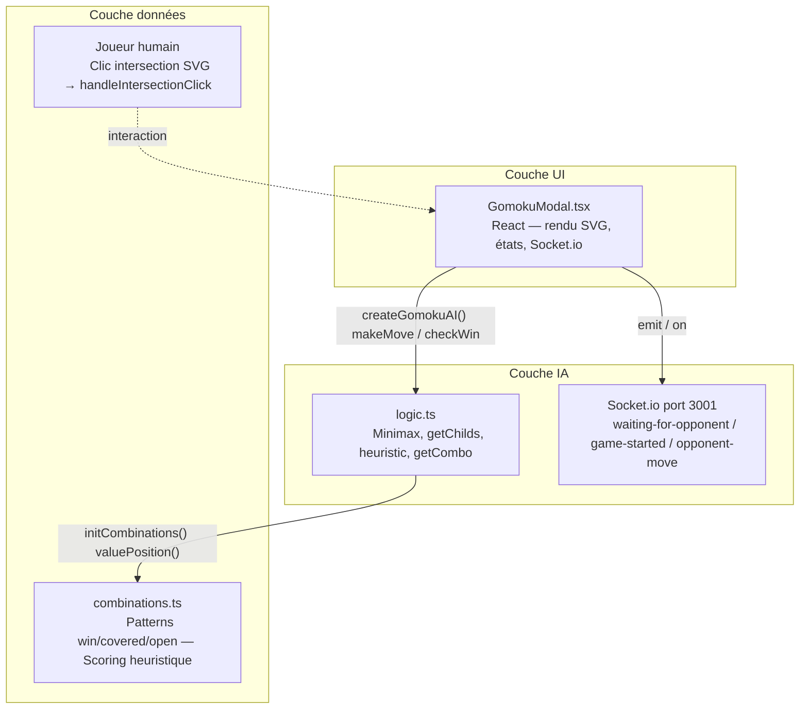

```mermaid 
flowchart TD
    subgraph UI ["Couche UI"]
        GM["GomokuModal.tsx
        React — rendu SVG, états, Socket.io"]
    end

    subgraph AI_Layer ["Couche IA"]
        LG["logic.ts
        Minimax, getChilds, heuristic, getCombo"]
        SK["Socket.io port 3001
        waiting-for-opponent / game-started / opponent-move"]
    end

    subgraph Data ["Couche données"]
        CB["combinations.ts
        Patterns win/covered/open — Scoring heuristique"]
        PL["Joueur humain
        Clic intersection SVG → handleIntersectionClick"]
    end

    GM -->|"createGomokuAI() makeMove / checkWin"| LG
    GM -->|"emit / on"| SK
    LG -->|"initCombinations() valuePosition()"| CB
    PL -.->|interaction| GM
```
