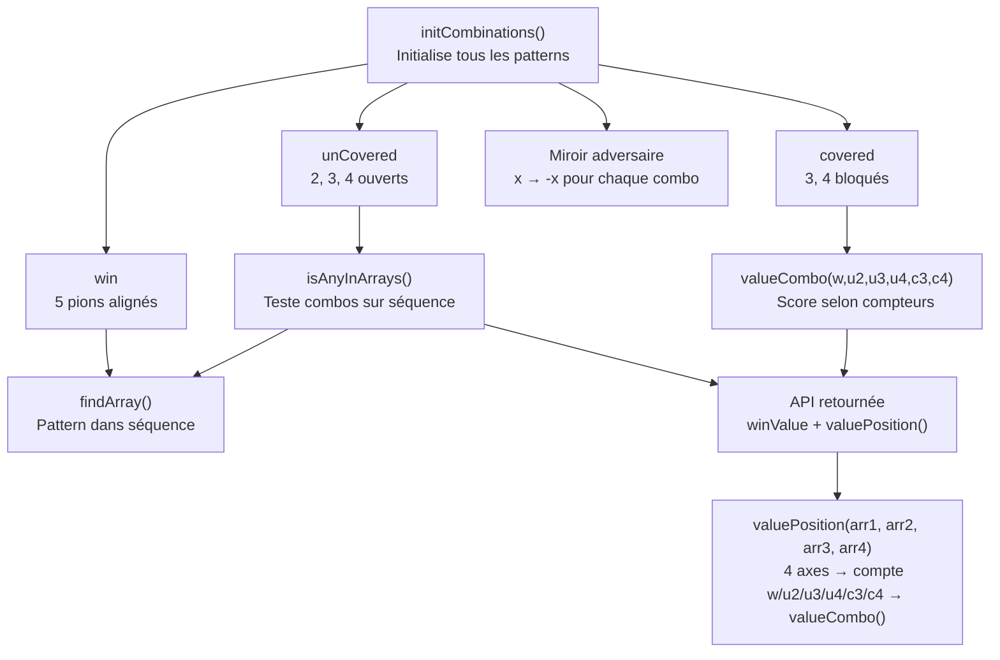

```mermaid
flowchart TD
    A["initCombinations()
    Initialise tous les patterns"]

    A --> B["win
    5 pions alignés"]
    A --> C["unCovered
    2, 3, 4 ouverts"]
    A --> D["covered
    3, 4 bloqués"]
    A --> E["Miroir adversaire
    x → -x pour chaque combo"]

    B --> F["findArray()
    Pattern dans séquence"]
    C --> G["isAnyInArrays()
    Teste combos sur séquence"]
    D --> H["valueCombo(w,u2,u3,u4,c3,c4)
    Score selon compteurs"]

    G --> F
    G --> I["API retournée
    winValue + valuePosition()"]
    H --> I

    I --> J["valuePosition(arr1, arr2, arr3, arr4)
    4 axes → compte w/u2/u3/u4/c3/c4 → valueCombo()"]
```
