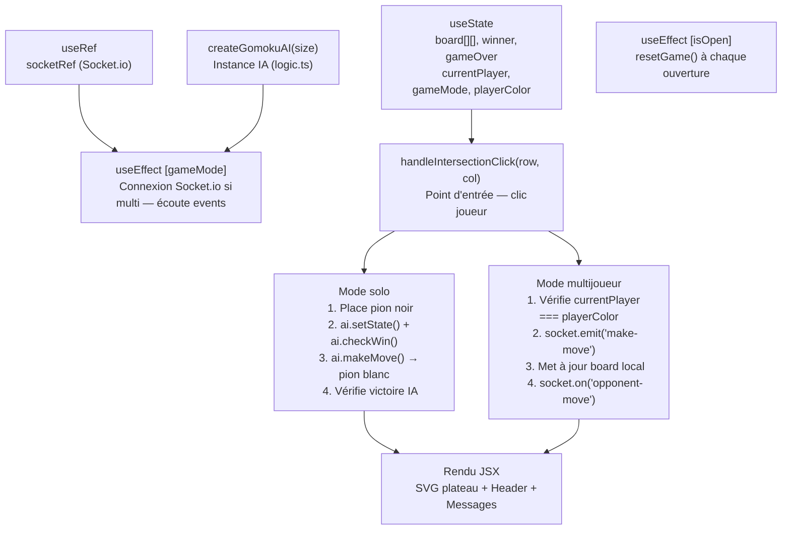

```mermaid
flowchart TD
    US["useState
    board[][], winner, gameOver
    currentPlayer, gameMode, playerColor"]

    UR["useRef
    socketRef (Socket.io)"]

    AI["createGomokuAI(size)
    Instance IA (logic.ts)"]

    EF1["useEffect [gameMode]
    Connexion Socket.io si multi — écoute events"]

    EF2["useEffect [isOpen]
    resetGame() à chaque ouverture"]

    UR --> EF1
    AI --> EF1

    HC["handleIntersectionClick(row, col)
    Point d'entrée — clic joueur"]

    US --> HC

    HC --> SOLO["Mode solo
    1. Place pion noir
    2. ai.setState() + ai.checkWin()
    3. ai.makeMove() → pion blanc
    4. Vérifie victoire IA"]

    HC --> MULTI["Mode multijoueur
    1. Vérifie currentPlayer === playerColor
    2. socket.emit('make-move')
    3. Met à jour board local
    4. socket.on('opponent-move')"]

    SOLO --> R["Rendu JSX
    SVG plateau + Header + Messages"]
    MULTI --> R
```
