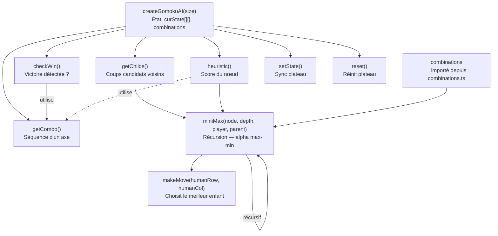

```mermaid
flowchart TD
    A["createGomokuAI(size)
    État: curState[][], combinations"]

    A --> B["getCombo()
    Séquence d'un axe"]
    A --> C["checkWin()
    Victoire détectée ?"]
    A --> D["getChilds()
    Coups candidats voisins"]
    A --> E["heuristic()
    Score du nœud"]

    C -->|utilise| B
    E -.->|utilise| B

    COMB["combinations
    importé depuis combinations.ts"]

    D --> MM["miniMax(node, depth, player, parent)
    Récursion — alpha max-min"]
    E --> MM
    COMB --> MM

    MM -->|récursif| MM

    MM --> MK["makeMove(humanRow, humanCol)
    Choisit le meilleur enfant"]

    A --> ST["setState()
    Sync plateau"]
    A --> RS["reset()
    Réinit plateau"]

```
